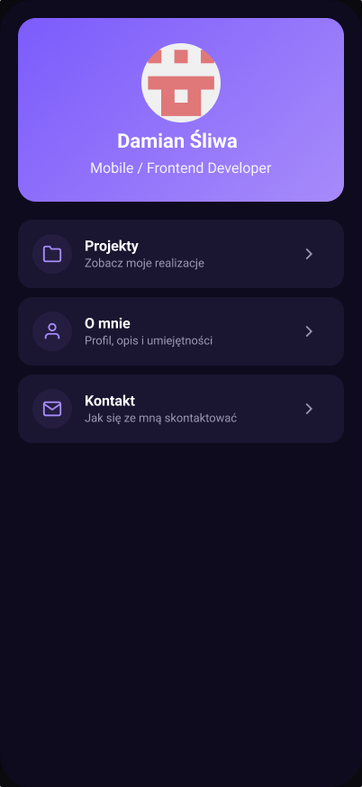
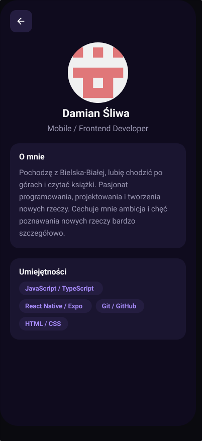
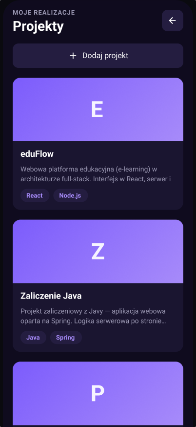
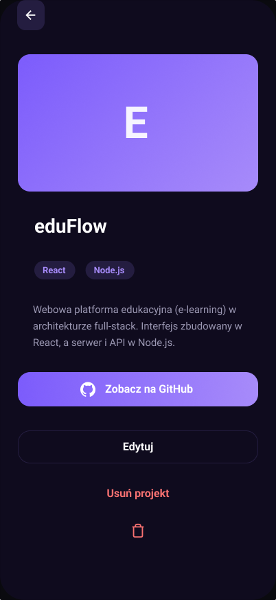
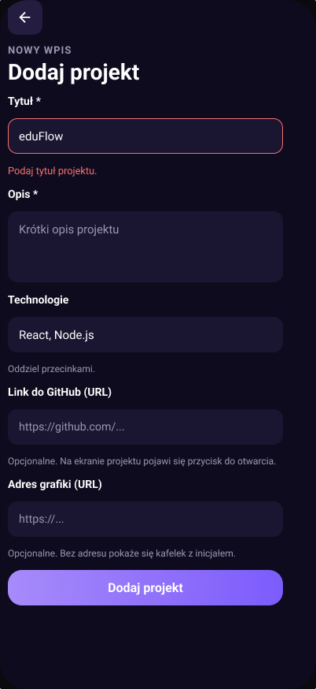
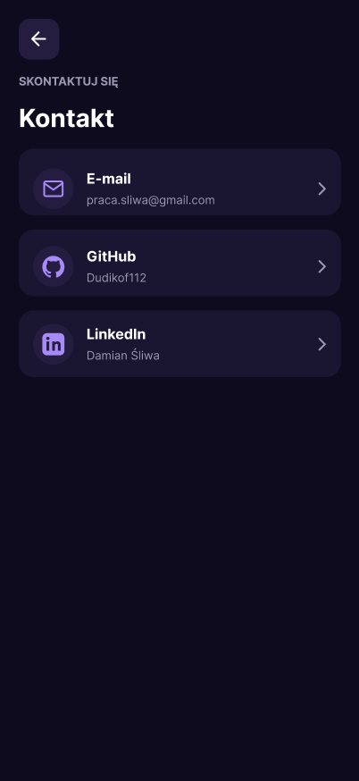

# Portfolio – Damian Śliwa

Mobilna aplikacja-portfolio zbudowana w React Native (Expo). Prezentuje profil studenta, listę projektów wraz ze szczegółami oraz dane kontaktowe. Pozwala dodawać własne projekty przez formularz z walidacją, a dane zapisywane są lokalnie na urządzeniu.

## Funkcjonalności

- Ekran startowy (menu) z nawigacją do sekcji
- Profil: zdjęcie, opis i umiejętności
- Lista projektów z grafiką i technologiami
- Szczegóły projektu z opisem, technologiami, edycją i usuwaniem
- Dodawanie i edycja projektów przez formularz
- Walidacja formularza (wymagany tytuł i opis)
- Trwały zapis danych (AsyncStorage) — projekty nie znikają po restarcie
- Ekran kontaktowy z klikalnymi pozycjami (e-mail, GitHub, LinkedIn)

## Technologie

- React Native + Expo (SDK 54)
- Expo Router (nawigacja oparta na plikach)
- TypeScript
- Zustand + AsyncStorage (stan i zapis lokalny)
- expo-linear-gradient, @expo/vector-icons

## Uruchomienie

Wymagania: Node.js oraz aplikacja Expo Go na telefonie (lub emulator).

```bash
npm install
npx expo start
```

Następnie zeskanuj kod QR aplikacją Expo Go (Android) lub aparatem (iOS). Przy problemach z połączeniem w sieci lokalnej pomaga tryb tunelu:

```bash
npx expo start --tunnel
```

## Struktura projektu

```
src/
  app/          ekrany i nawigacja (Expo Router)
  components/   komponenty wielokrotnego uzytku
  store/        magazyn projektow (Zustand + AsyncStorage)
  constants/    motyw (kolory, odstepy, typografia)
  utils/        funkcje pomocnicze
```

## Makiety (Figma)

Pełny projekt graficzny w Figmie: [otwórz makiety](DODAJ_LINK_DO_FIGMY)

| Menu | Profil | Projekty |
|---|---|---|
|  |  |  |

| Szczegóły | Formularz | Kontakt |
|---|---|---|
|  |  |  |

## Autor

Damian Śliwa
