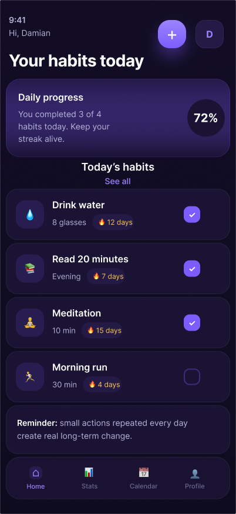
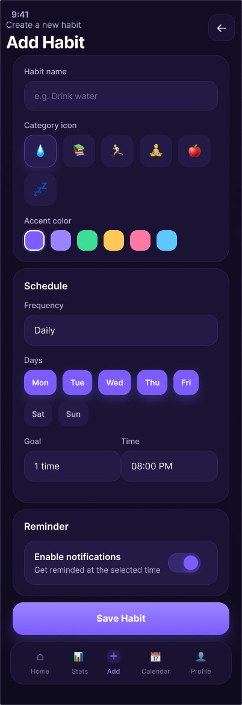
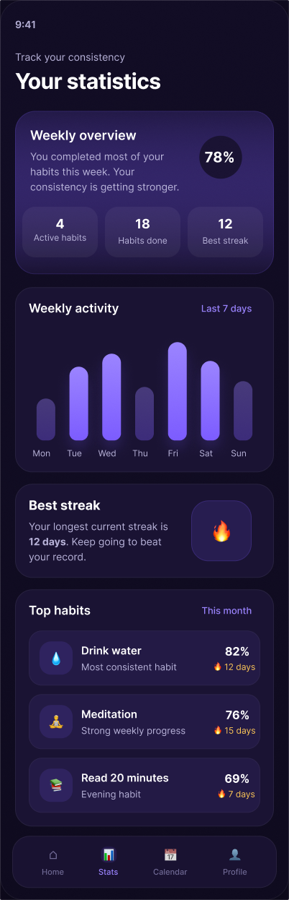
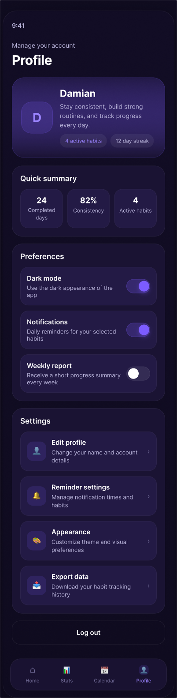

# StreakUp

Aplikacja mobilna do śledzenia codziennych nawyków i monitorowania postępów. Wspiera budowanie regularności poprzez system streaków (ciągłości), wizualizację postępów oraz czytelny, ciemny interfejs.

Projekt portfolio zbudowany w React Native (Expo).

---

## Funkcje

- Dodawanie, edycja i usuwanie nawyków
- Oznaczanie wykonania na dany dzień z **trwałym zapisem** (dane przeżywają zamknięcie aplikacji)
- **Streaki** (ciągłość wykonywania) liczone na podstawie historii
- Statystyki i analiza postępów: tygodniowy przegląd, wykres aktywności, najlepsze nawyki
- Kalendarz z oznaczonymi dniami wykonania
- Profil z podsumowaniem i ustawieniami
- **Lokalne przypomnienia** o nawykach o wybranej porze
- Spójny, ciemny motyw oparty na własnym systemie komponentów

---

## Zrzuty ekranu

| Dashboard | Add Habit | Habit Details |
|---|---|---|
|  |  |  |

| Statistics | Profile |
|---|---|
|  |  |

> Jeśli zrzuty zostaną przeniesione do osobnego folderu (np. `docs/`), zaktualizuj ścieżki powyżej.

---

## Widoki aplikacji

1. **Dashboard (Home)** — lista nawyków na dziś, dzienny postęp i szybkie oznaczanie wykonania
2. **Add Habit** — tworzenie i edycja nawyku (nazwa, ikona, kolor, dni, cel, godzina, przypomnienie)
3. **Habit Details** — szczegóły nawyku, statystyki i historia bieżącego tygodnia
4. **Statistics** — przegląd tygodnia, wykres aktywności i najlepsze nawyki
5. **Calendar** — kalendarz wykonań
6. **Profile** — podsumowanie, preferencje i ustawienia

---

## Stack technologiczny

- **React Native** + **Expo** (Expo Router — nawigacja oparta na plikach)
- **TypeScript**
- **Zustand** + **AsyncStorage** — globalny stan z trwałym zapisem
- **expo-notifications** — lokalne przypomnienia
- **react-native-calendars** — widok kalendarza
- **expo-linear-gradient**, **@expo/vector-icons** — interfejs

---

## Struktura projektu

```
src/
├─ app/                 # ekrany i nawigacja (Expo Router)
│  ├─ (tabs)/           # zakladki: Home, Stats, Calendar, Profile
│  ├─ habit/[id].tsx    # szczegoly nawyku
│  ├─ add.tsx           # tworzenie / edycja nawyku
│  └─ habits.tsx        # pelna lista nawykow
├─ components/          # komponenty UI wielokrotnego uzytku
├─ constants/           # motyw (kolory, typografia, odstepy)
├─ store/               # magazyn nawykow (Zustand + AsyncStorage)
└─ utils/               # statystyki nawykow i powiadomienia
```

---

## Uruchomienie

### Wymagania

- Node.js w wersji LTS (20 lub nowszej)
- Aplikacja **Expo Go** na telefonie (Android/iOS) lub emulator

### Instalacja

```bash
git clone https://github.com/Dudikof112/Portfolio-Damian-Sliwa.git
cd Portfolio-Damian-Sliwa
npm install
npx expo start
```

Następnie zeskanuj kod QR aplikacją Expo Go.

> Jeśli telefon nie łączy się z serwerem przez sieć lokalną, użyj trybu tunelu:
> ```bash
> npx expo start --tunnel
> ```

---

## Uwagi

- Lokalne przypomnienia działają na fizycznym urządzeniu (nie na emulatorze). Powiadomienia push nie są obsługiwane w Expo Go — wymagałyby development buildu.
- Przy pierwszym uruchomieniu aplikacja zawiera kilka przykładowych nawyków; po oznaczaniu i tworzeniu własnych dane są w pełni Twoje i zapisywane lokalnie.

---

## Autor

Damian Śliwa
